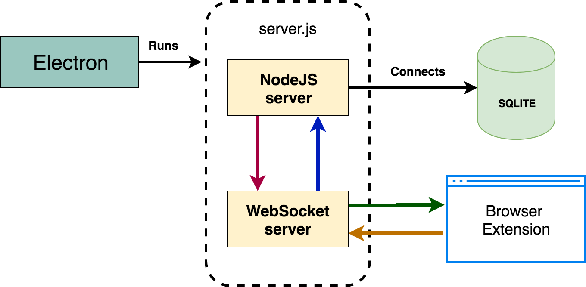

# memo_cards

**Learn vocabulary faster using flashcards**

This is an Electron application based on the [Electron Quick Start Guide](https://github.com/electron/electron-quick-start).

<iframe width="560" height="315" src="https://www.youtube.com/embed/FPTfWYo9O4E" frameborder="0" allow="accelerometer; autoplay; encrypted-media; gyroscope; picture-in-picture" allowfullscreen></iframe>

A basic Electron application files:

- `package.json` - Points to the app's main file and lists its details and dependencies.
- `main.js` - Starts the app and creates a browser window to render HTML. This is the app's **main process**.

## To Use

To clone and run this repository you'll need [Git](https://git-scm.com) and [Node.js](https://nodejs.org/en/download/) (which comes with [npm](http://npmjs.com)) installed on your computer. From your command line:

```bash
# Clone this repository
git clone https://github.com/malik-aliyev-94/memo_cards
# Go into the repository
cd memo_cards
# Install dependencies
npm install
# Run the app
npm start
# Run the dist
npm dist
```

After running `npm dist` you can run **memo_cards.app** (on MacOS). This will also run nodejs server (:4200), you can open http://localhost:4200 on browser too. 




Browser extensions for Chrome (chrome-ext) and Safari (VocaExt.safariextension) are also available. 
These extensions needed to easily add new words from translate.google.com

1. [How to install chrome extension](https://youtu.be/9ohZIh-nSyU)
2. [How to install safari extension](https://youtu.be/O1vm1kRP25I)

Once you have translated the word, you can click the extension button on toolbar and save the new word to your vocabulary. 

You can also run only web app (without electron). 

`node ./server.js` or `nodemon ./server.js`

To run Node.js server file automatically after launching Electron App, 

`require('./server');` and `mainWindow.loadURL('http://localhost:4200')`

lines are added to `main.js` electron app file.

As a database SQLITE have been used. You can read more about how to use sqlite with nodejs from [here](http://www.sqlitetutorial.net/sqlite-nodejs/)


Give attntion to the database connection in server.js file

```javascript
// Database connection
var db = new sqlite3.Database(path.join(__dirname, 'app.db').replace('/app.asar', ''), (err) => {
  if (err) {
    return console.error(err.message);
  }
  console.log('database: Connected');
});
```

`path.join(__dirname, 'app.db').replace('/app.asar', '')` have been used to solve **db-file is not found within app.asar** problem (Electron sqlite3 issue after packaging app).

As a front-end framework [materialize](http://materializecss.com/) have been used.

You can scrap content from [vocabulary.com](https://www.vocabulary.com) after new word have been added. 

Read more about Web Scraping with NodeJS --> [Parsing HTML with Cheerio.js](https://medium.freecodecamp.org/the-ultimate-guide-to-web-scraping-with-node-js-daa2027dcd3)

## License

[CC0 1.0 (Public Domain)](LICENSE.md)
